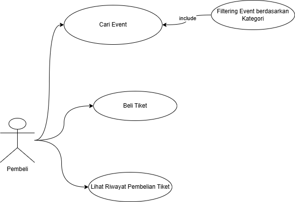

# DINUS EVENT

## Gambaran Umum

Dinus event merupakan simulasi sistem pemesanan tiket event berbasis web yang dikembangkan
menggunakan framework Laravel. Sistem ini memungkinkan admin untuk mengelola data event dan
kategori, serta memungkinkan user untuk memesan tiket tanpa melalui proses pembayaran. Setiap
pemesanan yang dilakukan akan langsung tercatat pada riwayat pembelian.

## Skema Aplikasi

## Pembeli

## Admin

### Struktur Database

**Kategori** berelasi one-to-many dengan **Event** , artinya satu kategori dapat memiliki banyak event, sementara setiap event hanya berada pada satu kategori (many-to-one dari Event ke Kategori). **User** juga memiliki relasi one-to-many dengan **Event** , karena satu user dapat membuat banyak event, tetapi satu event hanya dibuat oleh satu user. Selanjutnya, **Event** berelasi one-to-many dengan **Tiket** , sehingga satu event bisa menyediakan beberapa tipe tiket seperti premium atau reguler, sedangkan tiap tiket hanya terkait ke satu event. Pada proses transaksi, **User** berelasi one-to-many dengan **Order** karena satu user bisa melakukan banyak pemesanan, dan **Event** juga one-to-many dengan **Order** karena satu event bisa dipesan oleh banyak user. Hubungan antara **Order** dan **Tiket** secara konsep adalah **many-to-many** , karena satu order dapat berisi beberapa jenis tiket dan satu jenis tiket bisa muncul di banyak order; relasi ini diwujudkan melalui tabel penghubung **Detail Order** yang menyimpan rincian pembelian seperti jumlah dan subtotal.

## Konsep MVC

Pada proyek **ini** , pola arsitektur yang dipakai adalah **MVC (Model–View–Controller)**. alur kerjanya dimulai dari **Route → Controller → Model → View**. Ketika pengguna membuka halaman di browser, permintaan (request) itu pertama kali “masuk” melalui **routing** yang didefinisikan di file web.php. Di file ini, semua URL atau “pintu masuk” aplikasi dipetakan: mana yang termasuk halaman **user** , mana yang termasuk halaman **admin** , dan masing-masing route diarahkan ke controller yang sesuai.

Setelah route menentukan tujuan, request diteruskan ke **Controller** , yaitu bagian yang mengatur logika
aplikasi. 

Untuk sisi **admin**, controller dibagi berdasarkan fitur:

- CategoryController menangani **CRUD kategori** (tambah, lihat, ubah, hapus),
- Admin/EventController menangani pengelolaan **event** ,
- TiketController mengelola **tiket** (biasanya terkait event),
- HistoriesController menangani **riwayat pembelian versi admin** ,
- DashboardController menyiapkan data yang tampil di halaman dashboard admin, seperti
    ringkasan atau statistik sederhana.

Untuk sisi user,

- HomeController bertugas menampilkan halaman utama dengan daftar event dan kategori,
- User/EventController menampilkan **detail event** (termasuk tiket yang tersedia), dan
- OrderController mengelola proses **checkout** serta **riwayat pembelian** user.

Jadi, controller itu ibarat “pengatur jalannya proses”: dia menentukan data apa yang perlu diambil,
validasi apa yang harus dicek, lalu view mana yang harus ditampilkan.

Untuk mengambil dan mengelola data, controller memanggil **Model** , yaitu representasi tabel database
sekaligus tempat relasi antar data didefinisikan. Model yang dipakai ada Kategori, Event, Tiket, Order,
DetailOrder.

Misalnya, melalui model **Event** , controller bisa mengambil semua event (Event::all()), mengambil satu
event berdasarkan id (Event::find($id)), dan memanfaatkan relasi seperti

- $event->tikets untuk mengambil semua tiket milik event tersebut (relasi **hasMany** ),
- $event->kategori untuk mengetahui kategori event (relasi **belongsTo** ), dan
- $event->user untuk mengetahui siapa penyelenggara/pembuat event (relasi **belongsTo** ).

Pada model **Kategori** , ada relasi

- $kategori->events yang berarti satu kategori memiliki banyak event ( **hasMany** ).
- Pada model **Tiket** , relasi $tiket->event menunjukkan tiket itu milik event tertentu ( **belongsTo** ),
    dan
- $tiket->orders menunjukkan tiket tersebut bisa muncul di banyak order melalui tabel penghubung
    detail order ( **belongsToMany** ).

Lalu pada model **Order**,

- relasi $order->user menunjukkan siapa pembelinya,
- $order->event menunjukkan event yang dibeli,
- $order->tikets menunjukkan daftar tiket yang dibeli (many-to-many), dan
- $order->detailOrders menyimpan rincian item pembelian seperti jumlah dan subtotal per tiket 

Sedangkan model **DetailOrder** berperan sebagai penghubung transaksi, karena dari detail itulah kita bisa melihat order induknya ($detail->order) dan tiket yang dibeli ($detail->tiket).

Setelah data didapat dan disiapkan oleh controller, hasilnya dikirim ke **View** untuk dirender menjadi tampilan yang dilihat pengguna. Untuk halaman user, home.blade.php sebagai halaman utama, show.blade.php untuk detail event, dan halaman order untuk daftar/riwayat pembelian.

Untuk admin, ada dashboard.blade.php untuk ringkasan admin, index.blade.php untuk listing data kategori/event/history, dan beberapa komponen UI seperti event-card.blade.php, sidebar.blade.php, serta layout seperti app.blade.php, admin.blade.php agar tampilan konsisten.

Contoh alurnya bisa dijelaskan sederhana: ketika user membuka route /, route itu akan memanggil HomeController@index, artinya menjalankan fungsi index di dalam class HomeController. Fungsi ini mengambil data event dan kategori dari model, lalu mengirimnya ke view home.blade.php untuk ditampilkan. Ketika user membuka /events/{event}, request diarahkan ke User/EventController@show untuk mengambil detail event beserta relasi tiketnya, lalu dirender ke show.blade.php. Sementara untuk admin, route seperti /admin/events memanggil Admin/EventController@index untuk menampilkan daftar

event pada halaman index.blade.php. Dengan pola ini, tiap bagian punya tugas jelas: **route sebagai pengarah, controller sebagai pengatur logika, model sebagai pengelola data/relasi, dan view sebagai tampilan**.

## Menginstal dan menjalankan Laravel.

Untuk menginstal dan menjalankan Laravel, pertama **nyalakan Apache dan MySQL di XAMPP**. Setelah itu buat project Laravel baru dengan perintah composer create-project laravel/laravel ticketing_app, lalu masuk ke folder project menggunakan cd ticketing_app. Berikutnya lakukan **konfigurasi database** di file .env dengan mengisi DB_CONNECTION=mysql, DB_HOST=127.0.0.1, DB_PORT=3306, DB_DATABASE=ticketing_app, DB_USERNAME=root, dan DB_PASSWORD= (kosong). Setelah database **ticketing_app** dibuat di MySQL, jalankan php artisan migrate untuk membuat
tabel-tabelnya. Terakhir, jalankan server development dengan php artisan serve dan akses aplikasi melalui [http://127.0.0.1:8000.](http://127.0.0.1:8000.)

## Catatan Singkat (Database, MVC, Instalasi & Running)

### Database

#### Migration
Dipakai untuk membuat table.

Cara menjalankannya:
- Dijalanin dengan `php artisan migrate`
- Dibatalkan dengan `php artisan migrate:rollback`
- Reset total dengan seed `php artisan migrate:fresh --seed`
- Reset total tanpa seed `php artisan migrate:fresh`
- Jika ingin mengedit migration lama: pastikan urutan migrationnya benar, pastikan semua table foreign key yang dihubungkan telah dibuat dulu, lakukan migration fresh, edit migration lama, lalu jalankan migrate fresh dengan seed.

#### Seeder
Dipakai untuk mengisi data awal/contoh ke database.

Cara menjalankannya:
- Buat seeder `php artisan make:seeder UserSeeder`
- Semua seeder: `php artisan db:seed`
- Seeder tertentu: `php artisan db:seed --class=CategorySeeder`

#### Factory
Bikin data palsu (dummy) untuk testing atau isi database banyak.

Cara menjalankannya:
- Buat `php artisan make:factory PostFactory --model=Post`

### MVC

#### Model
Representasi tabel di database serta mendefinisikan relasi dan dipakai untuk query/insert/update/delete.

Contoh perintah:
- `php artisan make:model Kategori -m`
- `php artisan make:model Event -m`
- `php artisan make:model Tiket -m`
- `php artisan make:model Order -m`
- `php artisan make:model DetailOrder -m`

#### View
Berisi tampilan (Blade) yang menampilkan data ke pengguna.

#### Controller
Berisi logika aplikasi, mengatur alur data dari model ke view.

### Instalasi & Running
Jika besok diperlukan saat ujian, karena mengerjakan wajib menggunakan PC lab.

Cara clone project:
1. Buka repository GitHub di browser, copy URL repository.
2. Jalankan:  
   `git clone --branch dinus-event-v2 --single-branch https://github.com/Feby-akliji23/Dinus-Event.git`
    `git clone --branch main --single-branch https://github.com/Feby-akliji23/Dinus-Event.git`

   
3. Buat folder baru di komputer, buka di VS Code.
4. Buka terminal, jalankan perintah: `git clone (url repository)`, tunggu sampai selesai.
5. Masuk ke direktori project, menu file → open folder, pilih folder project.
6. Buka terminal, jalankan perintah: `composer install`, tunggu sampai selesai.
7. Buka terminal, jalankan perintah: `npm install`, tunggu sampai selesai.
8. Rename file `.env.example` menjadi `.env`, atur konfigurasi database (biasanya di baris 23).
9. Buka terminal, jalankan perintah: `php artisan key:generate`.
10. Buka terminal, jalankan perintah: `php artisan migrate`.
11. Buka terminal, jalankan perintah: `php artisan db:seed`.
12. Buka terminal baru, jalankan perintah: `php artisan serve`.
13. Buka terminal baru, jalankan perintah: `npm run dev`.

Disarankan: pakai terminal yang tipenya **Command Prompt**.

### Storage image/file tidak kebaca (public storage)
- `php artisan storage:link`

### Instalasi Laravel Breeze
- `composer require laravel/breeze --dev`
- `php artisan breeze:install`

### Middleware
Buat Middleware:
- `php artisan make:middleware AdminMiddleware`

## Membuat, menjalankan dan memahami migration database dan fungsi model

**migration** digunakan untuk mendefinisikan struktur tabel dan relasi secara rapi, lalu **menjalankannya dengan php artisan migrate** supaya seluruh tabel benar-benar terbentuk di database sesuai rancangan.

Migration yang dibuat di projek ini mencakup

- tabel **users** lengkap dengan kebutuhan autentikasi (password reset dan sessions),
- tabel **kategoris** untuk menyimpan nama kategori yang unik,
- tabel **events** yang terhubung ke users dan kategoris melalui foreign key,
- tabel **tikets** yang terhubung ke events untuk menyimpan tipe tiket, harga, dan stok,
- tabel **orders** yang mencatat transaksi user terhadap event, dan
- tabel **detail_orders** sebagai tabel pivot yang menghubungkan order dan tiket sekaligus menyimpan detail jumlah serta subtotal harga.

Dengan migration dipastikan database konsisten, bisa diulang dari awal, dan relasinya otomatis terjaga lewat foreign key dan cascade.

Setelah database terbentuk, **model** digunakan sebagai “jembatan” antara aplikasi dan database. Model dipakai untuk membaca dan menulis data tabel, sekaligus mendefinisikan relasi agar pengambilan data lebih mudah.

Misalnya

- model **Kategori** menyediakan relasi bahwa satu kategori memiliki banyak event,
- model **Event** terhubung ke user dan kategori serta memiliki banyak tiket,
- model **Tiket** terhubung ke event dan dapat muncul di banyak order melalui tabel pivot detail_orders,
- model **Order** terhubung ke user dan event serta menyimpan daftar tiket yang dibeli beserta detailnya, dan
- model **DetailOrder** menyimpan rincian item transaksi per tiket dan menghubungkan kembali ke order dan tiket.

## Seeder

Pada proyek ini, **seeder** digunakan untuk mengisi **data awal atau data contoh** agar aplikasi bisa langsung dicoba tanpa harus memasukkan data manual dari awal.

Tujuannya supaya saat pertama kali aplikasi dijalankan, halaman seperti home dan dashboard tidak kosong, proses testing UI jadi lebih mudah karena data event, tiket, dan order sudah tersedia, serta relasi antar data tetap rapi dan konsisten, misalnya event sudah memiliki kategori, tiket terhubung ke event, dan
order memiliki detail pembelian.

Seeder yang disiapkan

- **UserSeeder** untuk membuat akun admin dan user biasa sehingga pengujian login dan hak akses bisa dilakukan,
- **CategorySeeder** untuk mengisi kategori awal seperti Konser, Seminar, dan Workshop agar fitur filter di halaman home berfungsi,
- **EventSeeder** untuk menambahkan beberapa event contoh lengkap dengan judul, deskripsi, tanggal, lokasi, dan gambar,
- **TicketSeeder** untuk menambahkan tiket reguler/premium dengan harga dan stok untuk event tertentu, serta
- **OrderSeeder** untuk membuat transaksi contoh beserta data detail_orders agar fitur riwayat pembelian bisa diuji.
- **DatabaseSeeder** untuk memanggil semua seeder tersebut secara berurutan.

Apabila hanya ingin mengisi data pada **tabel tertentu saja**

- php artisan db:seed --class=CategorySeeder
- php artisan db:seed --class=UserSeeder
- php artisan db:seed --class=EventSeeder
- php artisan db:seed --class=TicketSeeder
- php artisan db:seed --class=OrderSeeder

**Menjalankan Semua Seeder Sekaligus**

- php artisan db:seed

## Install Laravel Breeze untuk sistem autentikasi

sistem autentikasi dibangun menggunakan **Laravel Breeze** , yaitu starter kit autentikasi resmi dari Laravel yang menyediakan fitur dasar seperti **register, login, logout, dan reset password** , sehingga pengembangan tidak perlu membuat auth dari nol.

Breeze berperan sebagai pondasi akses pengguna untuk seluruh fitur, karena hanya pengguna yang sudah login yang dapat mengakses route tertentu, termasuk fitur event, order, dan halaman admin.

Komponen Breeze yang digunakan mencakup

- **routes autentikasi** di auth.php untuk endpoint login/register/logout,
- **controller autentikasi** di folder app/Http/Controllers/Auth/ untuk memproses login dan register,
- **view autentikasi** di resources/views/auth/ untuk tampilan form,
- serta tabel **users** dari migration sebagai tempat penyimpanan data user, role, dan password.

Alur kerjanya sederhana: pengguna membuka halaman /login, mengisi form, diproses oleh controller, lalu session disimpan; setelah berhasil login pengguna bisa mengakses route yang dilindungi middleware auth, dan saat logout session dihapus sehingga kembali ke halaman login. Untuk kebutuhan admin, route admin
dilindungi oleh middleware auth dan admin, sehingga Breeze memastikan pengguna sudah login terlebih dulu, kemudian middleware admin memastikan role-nya memang admin.

Instalasinya dilakukan dengan composer require laravel/breeze --dev lalu php artisan breeze:install, kemudian melengkapi aset frontend dengan menjalankan npm install dan npm run build

## Implementasi CRUD

Pada proyek ini, implementasi **CRUD** dibagi jelas antara fitur **admin** dan **user**. Untuk **CRUD Kategori** , admin menggunakan route resource di web.php yang mengarah ke CategoryController, sehingga proses seperti melihat daftar kategori, menambah, mengubah, dan menghapus data ditangani melalui method index, store, update, dan destroy. Seluruhnya ditampilkan pada index.blade.php dalam bentuk list kategori, dengan bantuan modal untuk aksi tambah, edit, dan hapus, lalu setelah submit controller memproses dan melakukan redirect kembali ke halaman list.

Untuk **CRUD Event** , admin juga memakai route resource yang terhubung ke EventController, lengkap dengan halaman list (index.blade.php), form tambah (create.blade.php), form edit (edit.blade.php), dan halaman detail (show.blade.php); alurnya pengguna admin mengisi form create atau edit, data diproses
lewat store atau update, lalu diarahkan kembali ke daftar event. Selanjutnya,

**CRUD Tiket** dilakukan admin dari dalam halaman detail event, di mana daftar tiket ditampilkan di show.blade.php dan aksi tambah/edit/hapus tiket dilakukan lewat modal yang memanggil TiketController (method store, update, destroy), kemudian sistem me-redirect kembali ke halaman detail event agar admin langsung melihat perubahan tiketnya.

Untuk sisi **user** , proses pemesanan dilakukan melalui fitur **Order/Checkout** yang dibuat melalui mekanisme fetch di show.blade.php (JavaScript checkout) yang mengirim data ke OrderController untuk menyimpan order beserta detail pembeliannya; setelah transaksi terbentuk, user dapat melihat **riwayat pembelian** pada index.blade.php dan membuka **detail order** pada show.blade.php.

https://www.notion.so/WBK-2025-Ticketing-App-2e08d8819df1801a8409dbe948fc17f9

membungkus seluruh proses pembuatan pesanan di dalam blok try–catch dan sebuah transaksi database agar alurnya aman, konsisten, dan mudah ditangani jika terjadi kesalahan. Pada bagian try, sistem memulai transaksi menggunakan DB::transaction(...) sehingga semua operasi penting—mulai dari pengecekan stok, perhitungan harga, pemilihan promo, pembuatan data order, pembuatan detail order, sampai pengurangan stok—dipandang sebagai satu paket pekerjaan yang harus berhasil semuanya atau gagal semuanya. Artinya, jika di tengah proses muncul error (misalnya stok tidak cukup atau promo tidak valid), maka transaksi otomatis dibatalkan (rollback) dan database kembali seperti sebelum proses dimulai; tidak akan ada kondisi “order sudah tersimpan tapi stok belum berkurang” atau “stok sudah berkurang tapi order gagal dibuat”.

Di dalam transaksi, langkah pertama adalah menentukan status pembayaran default. Kode PaymentStatus::orderBy('id')->value('id') mengambil id status pembayaran paling awal (berdasarkan urutan id terkecil), yang biasanya merepresentasikan status seperti “pending” atau “menunggu pembayaran”. Jika ternyata tabel status pembayaran kosong sehingga tidak ada id yang bisa diambil, kode langsung melempar exception “Status pembayaran belum tersedia.”. Ini adalah guard clause untuk memastikan pembuatan order tidak berjalan tanpa status yang jelas, karena status pembayaran adalah komponen penting dari alur bisnis.

Setelah itu sistem menyiapkan variabel perhitungan: $total untuk menampung subtotal keseluruhan, $lineTotals untuk menampung subtotal per tiket (berdasarkan tiket_id), dan $ticketTypeTotals untuk menampung subtotal per jenis tiket (berdasarkan ticket_type_id). Ketiga variabel ini dipakai untuk dua tujuan utama: (1) mendapatkan subtotal pembelian sebelum diskon, dan (2) menyiapkan data agregasi yang diperlukan apabila promo memiliki aturan khusus, misalnya diskon hanya berlaku pada tiket tertentu atau pada tipe tiket tertentu. Kemudian dimulai loop pertama foreach ($data['items'] as $it) yang berperan sebagai tahap validasi stok sekaligus perhitungan harga. Pada setiap item, sistem mengambil data tiket menggunakan Tiket::lockForUpdate()->findOrFail($it['tiket_id']). Bagian lockForUpdate() sangat krusial karena memberi row-level lock pada baris tiket tersebut selama transaksi berjalan, sehingga jika ada dua pengguna melakukan checkout tiket yang sama secara bersamaan, transaksi kedua harus menunggu sampai transaksi pertama selesai. Ini mencegah race condition yang bisa menyebabkan stok “kebobolan” (misalnya stok tersisa 1 tapi terjual 2 karena dua proses membaca stok yang sama di waktu yang hampir bersamaan).

Masih di dalam loop pertama, sistem membandingkan stok tiket dengan jumlah yang diminta pengguna: jika $t->stok < $it['jumlah'], maka proses langsung dihentikan dengan exception “Stok tidak cukup…”. Pesan errornya dibuat lebih informatif dengan mengambil nama tipe tiket melalui $t->ticketType?->nama ?? 'tiket'. Operator ?-> (nullsafe) memastikan jika relasi ticketType tidak ada, program tidak error; dan ?? 'tiket' memberi nilai cadangan agar pesan tetap terbentuk. Bila stok aman, sistem menghitung subtotal per item ($lineTotal) sebagai harga tiket dikali jumlah yang dibeli. Nilai ini kemudian ditambahkan ke $total sebagai subtotal seluruh pembelian. Selain itu, nilai $lineTotal juga dicatat dalam $lineTotals untuk tiket tertentu, menggunakan pola ($lineTotals[$t->id] ?? 0) + $lineTotal yang berarti: “kalau tiket ini sudah pernah muncul sebelumnya, tambah akumulasinya; kalau belum, mulai dari 0”. Jika tiket memiliki ticket_type_id, subtotal item tersebut juga diakumulasikan ke $ticketTypeTotals agar nanti promo bisa menghitung diskon berdasarkan total belanja pada tipe tiket tertentu.

Setelah loop pertama selesai, sistem sudah memiliki tiga informasi penting: subtotal keseluruhan ($total), subtotal per tiket ($lineTotals), dan subtotal per tipe tiket ($ticketTypeTotals). Dengan bekal ini, sistem memanggil resolvePromo(...) untuk menentukan promo yang digunakan dan besar diskonnya. Fungsi ini dapat bekerja dalam berbagai skenario: menggunakan promo yang dimasukkan pengguna lewat kode, menggunakan promo berdasarkan id, atau memilih promo terbaik yang memenuhi syarat. Hasilnya dikembalikan dalam bentuk dua nilai: objek promo (atau null bila tidak ada promo yang dipakai) dan angka diskon. Tahap ini ditempatkan setelah perhitungan subtotal karena aturan promo umumnya bergantung pada total pembelian atau komposisi pembelian.

Berikutnya, sistem membuat record Order sebagai “header” pesanan yang merangkum seluruh transaksi. Field yang diisikan mencakup user_id (pemilik pesanan), event_id (event yang dibeli), payment_type_id (metode pembayaran), payment_status_id (status default yang sudah dipilih di awal), promo_id (id promo jika ada), subtotal_harga (total sebelum diskon), diskon, order_date (waktu transaksi), dan total_harga (total setelah diskon). Perhitungan total_harga menggunakan max(0, $total - $diskon) untuk mencegah nilai negatif, misalnya jika diskon lebih besar dari subtotal. Penggunaan $promo?->id memastikan jika promo tidak ada maka promo_id akan null tanpa menyebabkan error.

Setelah header order tercipta, barulah sistem masuk ke loop kedua foreach ($data['items'] as $it) untuk membuat detail pesanan satu per satu dan melakukan pengurangan stok. Di setiap iterasi, tiket diambil lagi memakai Tiket::findOrFail(...), lalu dihitung subtotal detail ($subtotal) berdasarkan harga dikali jumlah. Kemudian sistem membuat DetailOrder yang berisi order_id (menghubungkan ke order yang barusan dibuat), tiket_id, jumlah, dan subtotal_harga. Setelah detail tersimpan, sistem mengurangi stok tiket dengan max(0, $t->stok - $it['jumlah']) lalu menyimpan perubahan stok. Inti loop kedua ini adalah memastikan bahwa struktur order lengkap: ada satu record Order sebagai ringkasan, dan beberapa record DetailOrder sebagai rincian item yang dibeli, sekaligus memperbarui stok agar inventory selalu akurat.

Setelah semua langkah di dalam transaksi sukses, fungsi transaksi mengembalikan objek $order. Karena tidak ada exception, Laravel otomatis melakukan commit transaksi sehingga semua perubahan—pembuatan order, detail order, dan stok—resmi tersimpan permanen. Kode kemudian menambahkan pesan session()->flash('success', 'Pesanan berhasil dibuat.') untuk kebutuhan notifikasi di halaman berikutnya (misalnya saat redirect pada aplikasi berbasis web). Terakhir, sistem mengembalikan respons JSON yang menandakan sukses (ok: true), mengirim order_id, dan memberikan URL redirect menuju halaman daftar order. Sebaliknya, jika terjadi exception kapan pun di dalam proses—baik karena stok kurang, promo tidak valid, status pembayaran tidak tersedia, atau error lain—maka kontrol masuk ke catch, transaksi otomatis dibatalkan, dan sistem mengembalikan JSON error (ok: false) beserta pesan errornya, menggunakan status HTTP 422 agar klien tahu bahwa input/proses tidak dapat dipenuhi.